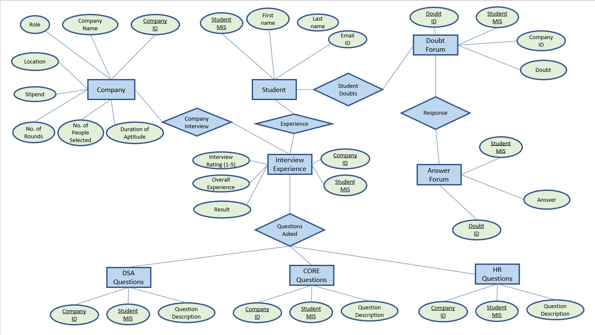
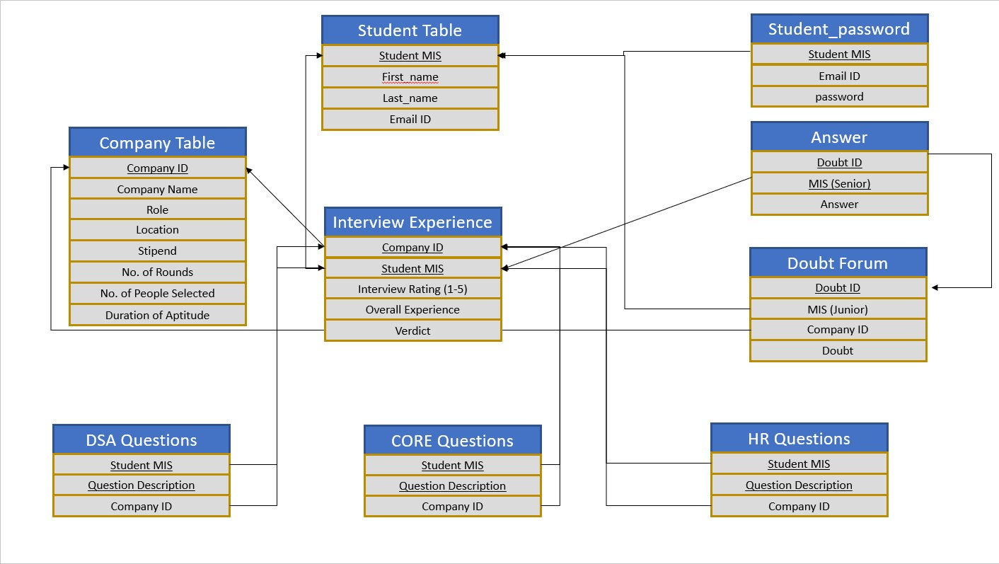
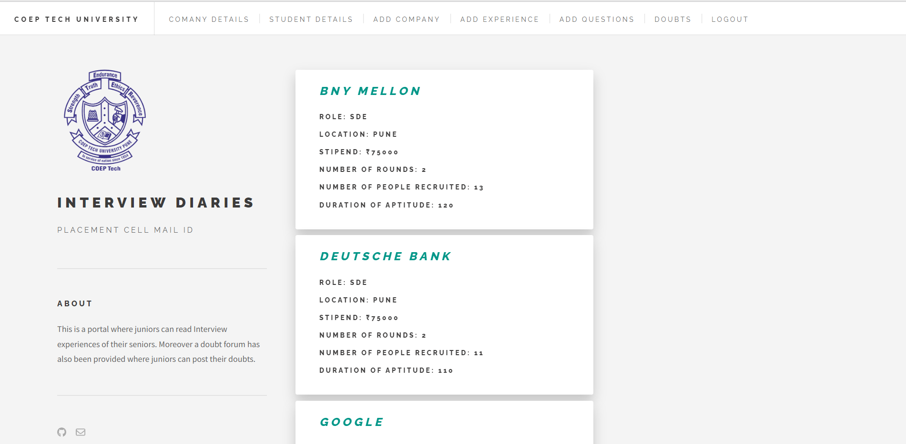
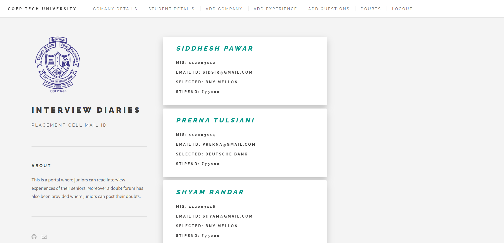
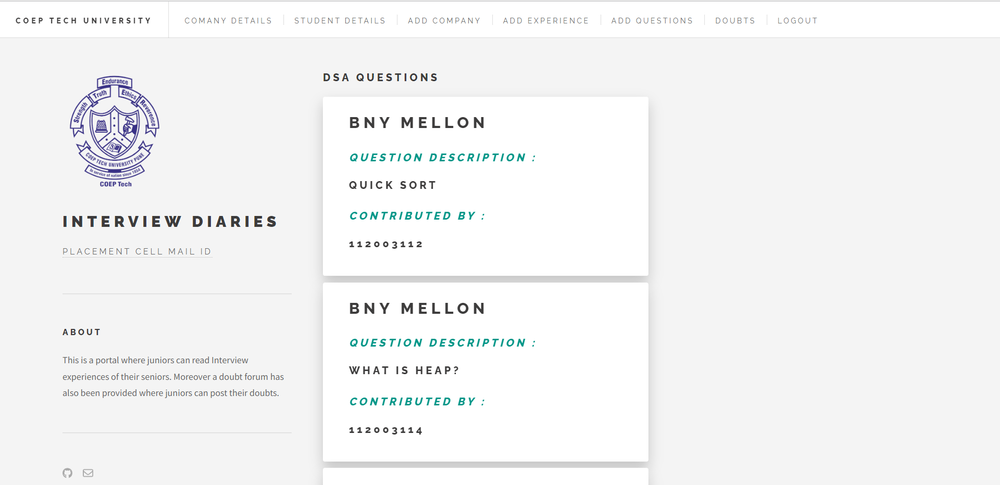
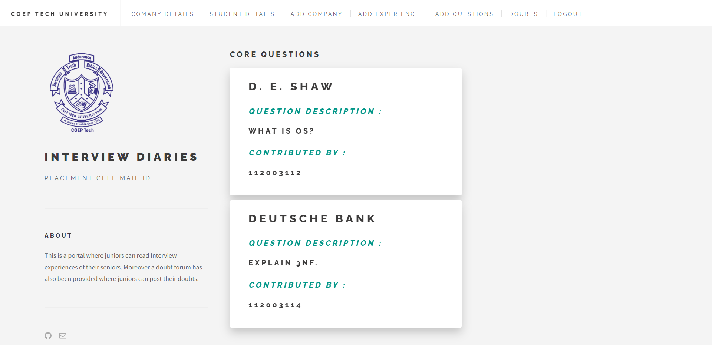
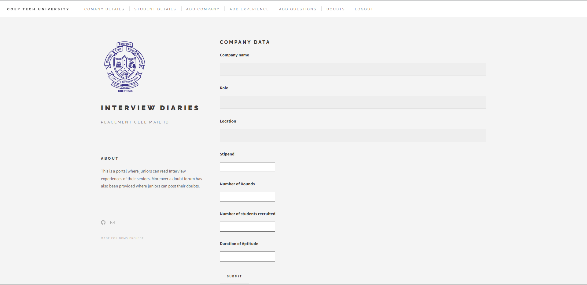
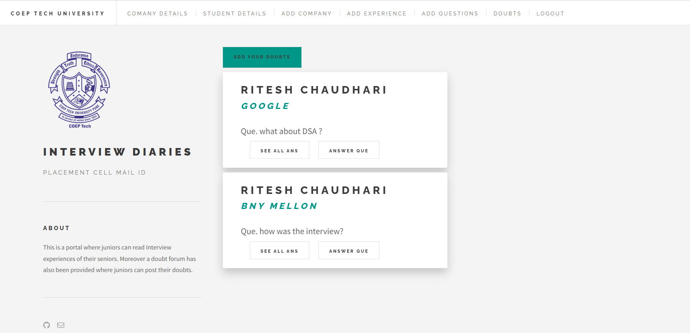

# Internship Portal
                                                                                                                
## Table of Contents

* [About the Project](#about-the-project)
  * [ER Diagram](#er-diagram)
  * [Relational Schema](#relational-schema)
  * [Built With](#built-with)
* [Getting Started](#getting-started)
  * [Installation](#installation)
* [Screenshots](#screenshots)
* [Team Members](#team)

## About the Project
This project is created to provide guidance to students so that they get familiarize with interview . It provides information about various comapanies and students.
Students can filter interview questions in different categories and also can filter questions as per companies. In case of queries students can also post their doubts
and other students could answer to it.

## ER Diagram


## Relational Schema



## Built With
<p float = "left">


</p>


## Getting Started

### Requirements
* Nodejs LTS(v14+)
* npm
* MySQL

### Installation
* To run the project on your Localhost :
    * Clone the repository : 
    ```sh 
    https://github.dev/Siddhesh4501/DBMS---Project
    ```
    * At the project root run : 
    ```sh
    npm i
    ```
    ```sh 
    npm start
    ```
        
## Screenshots
  - ### Company Details

  - ### Student Details

  - ### DSA Questions

  - ### Core Questions

  - ### Add Company

  - ### Doubt Forum


## Team 
1. [112003112 - Siddhesh Pawar](https://github.com/Siddhesh4501)
2. [112003114 - Prerna Tulsiani](https://github.com/pt3002)
3. [112003116 - Shyam Randar](https://github.com/ShyamR12)

